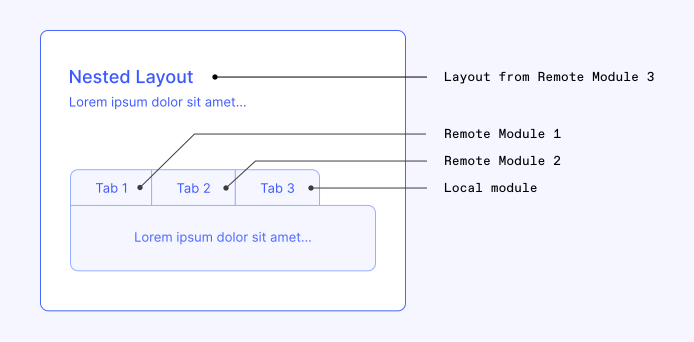

# Federated tabs

While it's typically recommended for a `@squide` application to maintain the boundary of a page within a single domain (e.g. module), there are situations where **enhancing** the **user experience** necessitates rendering a page with parts from **multiple domains**, or at the very least, simulating it 😊.

For this guide, we'll take as an example a page for which the parts that are owned by different domains are organized by tabs (federated tabs):

- `Tab 1`: Registered by `Remote Module 1`
- `Tab 2`: Registered by `Remote Module 2`
- `Tab 3`: Registered by `Local Module`

:::align-image-left

:::

## Define a nested layout

To construct this page while adhering to `@squide` constraint of exclusively permitting route exports from modules to maintain a high degree of decoupling in the application, let's begin by defining a React Router [nested layout](https://reactrouter.com/en/main/start/tutorial#nested-routes). This nested layout will be responsible for rendering all the tab headers and the content of the active tab:

```tsx !#9-11,15 remote-module-3/src/federated-tabs-layout.tsx
import { Suspense } from "react";
import { Link, Outlet } from "react-router-dom";

export default function FederatedTabsLayout() {
    return (
        <div>
            <p>Every tab is registered by a different module.</p>
            <ul style={{ listStyleType: "none", margin: 0, padding: 0, display: "flex", gap: "20px" }}>
                <li><Link to="federated-tabs/tab-1">Tab 1</Link></li>
                <li><Link to="federated-tabs/tab-2">Tab 2</Link></li>
                <li><Link to="federated-tabs/tab-3">Tab 3</Link></li>
            </ul>
            <div style={{ padding: "20px" }}>
                <Suspense fallback={<div>Loading...</div>}>
                    <Outlet />
                </Suspense>
            </div>
        </div>
    );
}
```

In the previous code sample, the `FederatedTabsLayout` is similar to the `RootLayout` introduced in previous guides. However, the key distinction is that this layout is nested under the `/federated-tabs` URL segment. By nesting the layout under a specific path, it will only render when the user navigates to one of the federated tab pages (e.g. `/federated-tabs/tab-1`, `/federated-tabs/tab-2`, `/federated-tabs/tab-3`).

To register the newly created layout as a nested layout, use the [registerRemoteModules](../reference/registration/registerRemoteModules.md) function:

```tsx !#8-9 remote-module-3/src/register.tsx
import type { ModuleRegisterFunction, Runtime } from "@squide/react-router";
import { FederatedTabsLayout } from "./FederatedTabsLayout.tsx";

export const register: ModuleRegisterFunction<Runtime> = runtime => {
    runtime.registerRoutes([
        {
            // Register the layout as a nested layout under the "/federated-tabs" URL segment.
            path: "/federated-tabs",
            element: <FederatedTabsLayout />
        }
    ]);

    runtime.registerNavigationItems([
        {
            to: "/federated-tabs",
            label: "Federated tabs"
        }
    ]);
}
```

With this nested layout in place, thanks to the React Router [Outlet](https://reactrouter.com/en/main/components/outlet) component, the content of the tabs can now reside in **distinct pages** (registered by different modules) while still delivering a **cohesive user experience**. Whenever a user navigates between the tabs, the URL will be updated, and the tab content will change, but the shared portion of the layout will remain consistent.

As a bonus, each individual tab will have its own dedicated URL! :partying_face:

## Create the tab routes

Next, let's add the actual tab pages to the modules. To do so, we'll use the [layoutPath](../reference/runtime/runtime-class.md#register-routes-under-a-specific-nested-layout-route) option of the [registerRoutes](../reference/runtime/runtime-class.md#register-routes) function to register the routes under the `FederatedTabsLayout`:

```tsx !#8,11 remote-module-1/src/register.tsx
import type { ModuleRegisterFunction, Runtime } from "@squide/react-router";
import { Tab1 } from "./Tab1.tsx";

export const register: ModuleRegisterFunction<Runtime> = (runtime: Runtime) => {
    runtime.registerRoutes([
        {
            // Using "index: true" instead of a path because this is the default active tab.
            index: true
            element: <Tab1 />
        }
    ], { layoutPath: "/federated-tabs" });
}
```

```tsx remote-module-1/src/Tab1.tsx
export function Tab1() {
    return (
        <div>Hey, this is Tab 1 content</div>
    );
}
```

```tsx !#8,11 remote-module-2/src/register.tsx
import type { ModuleRegisterFunction, Runtime } from "@squide/react-router";
import { Tab2 } from "./Tab2.tsx";

export const register: ModuleRegisterFunction<Runtime> = runtime => {
    runtime.registerRoutes([
        {
            // The first part of the "path" must be the same as the nested layout path (FederatedTabsLayout).
            path: "/federated-tabs/tab-2"
            element: <Tab2 />
        }
    ], { layoutPath: "/federated-tabs" });
}
```

```tsx remote-module-2/src/Tab2.tsx
export function Tab2() {
    return (
        <div>Hey, this is Tab 2 content</div>
    );
}
```

```tsx !#8,11 local-module/src/register.tsx
import type { ModuleRegisterFunction, Runtime } from "@squide/react-router";
import { Tab3 } from "./Tab3.tsx";

export const register: ModuleRegisterFunction<Runtime> = (runtime: Runtime) => {
    runtime.registerRoutes([
        {
            // The first part of the "path" must be the same as the nested layout path (FederatedTabsLayout).
            path: "/federated-tabs/tab-3"
            element: <Tab3 />
        }
    ], { layoutPath: "/federated-tabs" });
}
```

```tsx local-module/src/Tab3.tsx
export function Tab3() {
    return (
        <div>Hey, this is Tab 3 content</div>
    );
}
```

Now that the tabs have been registered, ensure that all four modules (including `remote-module-3`) are registered in the host application. Start the development servers using the `dev` script. Navigate to the `/federated-tabs` page, and you should see the tab headers. Click on each tab header to confirm that the content renders correctly.

## Decouple the navigation items

Althought it's functional, there are still a few configurations needed since the modules are currently coupled by hardcoded URLs within the `FederatedTabsLayout`.

To decouple the navigation items, similar to what is done for regular federated pages, we'll utilize the [registerNavigationItems](../reference/runtime/runtime-class.md#register-navigation-items) function. In this case, we'll also use the [menuId](../reference/runtime/runtime-class.md#register-navigation-items-for-a-specific-menu) option. Defining the `menuId` option will enable the `FederatedTabsLayout` to retrieve navigation items exclusively for the federated tab component.

First, let's register the navigation items with the `menuId` option:

```tsx !#20 remote-module-1/src/register.tsx
import type { ModuleRegisterFunction, Runtime } from "@squide/react-router";
import { Tab1 } from "./Tab1.tsx";

export const register: ModuleRegisterFunction<Runtime> = runtime => {
    runtime.registerRoutes([
        {
            // Using "index: true" instead of a path because this is the default active tab.
            index: true
            element: <Tab1 />
        }
    ], { layoutPath: "/federated-tabs" });

    runtime.registerNavigationItems([
        {
            to: "/federated-tabs",
            label: "Tab 1"
        }
    // The menu id could be anything, in this example we are using the same path as the nested layout
    // path for convenience.
    ], { menuId: "/federated-tabs" });
}
```

```tsx !#20 remote-module-2/src/register.tsx
import type { ModuleRegisterFunction, Runtime } from "@squide/react-router";
import { Tab2 } from "./Tab2.tsx";

export const register: ModuleRegisterFunction<Runtime> = (runtime: Runtime) => {
    runtime.registerRoutes([
        {
            // The first part of the "path" must be the same as the nested layout path (FederatedTabsLayout).
            path: "/federated-tabs/tab-2"
            element: <Tab2 />
        }
    ], { layoutPath: "/federated-tabs" });

    runtime.registerNavigationItems([
        {
            to: "/federated-tabs/tab-2",
            label: "Tab 2"
        }
    // The menu id could be anything, in this example we are using the same path as the nested layout
    // path for convenience.
    ], { menuId: "/federated-tabs" });
}
```

```tsx !#20 local-module/src/register.tsx
import type { ModuleRegisterFunction, Runtime } from "@squide/react-router";
import { Tab3 } from "./Tab3.tsx";

export const register: ModuleRegisterFunction<Runtime> = runtime => {
    runtime.registerRoutes([
        {
            // The first part of the "path" must be the same as the nested layout path (FederatedTabsLayout).
            path: "/federated-tabs/tab-3"
            element: <Tab3 />
        }
    ], { layoutPath: "/federated-tabs" });

        runtime.registerNavigationItems([
        {
            to: "/federated-tabs/tab-3",
            label: "Tab 3"
        }
    // The menu id could be anything, in this example we are using the same path as the nested layout
    // path for convenience.
    ], { menuId: "/federated-tabs" });
}
```

Then, update the `FederatedTabsLayout` to render the registered navigation items instead of the hardcoded the URLs:

```tsx !#32 remote-module-3/src/federated-tabs-layout.tsx
import { 
    useNavigationItems,
    useRenderedNavigationItems,
    type NavigationLinkRenderProps,
    type RenderItemFunction,
    type RenderSectionFunction
} from "@squide/react-router";
import { Suspense } from "react";
import { Link, Outlet } from "react-router-dom";

const renderItem: RenderItemFunction = (item, index, level) => {
    const { label, linkProps } = item as NavigationLinkRenderProps;

    return (
        <li key={`${level}-${index}`}>
            <Link {...linkProps}>
                {label}
            </Link>
        </li>
    );
};

const renderSection: RenderSectionFunction = elements => {
    return (
        <ul style={{ listStyleType: "none", margin: 0, padding: 0, display: "flex", gap: "20px" }}>
            {elements}
        </ul>
    );
};

export default function FederatedTabsLayout() {
    const navigationItems = useNavigationItems("/federated-tabs");
    const renderedTabs = useRenderedNavigationItems(navigationItems, renderItem, renderSection);

    return (
        <div>
            <p>Every tab is registered by a different module.</p>
            {renderedTabs}
            <div style={{ padding: "20px" }}>
                <Suspense fallback={<div>Loading...</div>}>
                    <Outlet />
                </Suspense>
            </div>
        </div>
    );
}
```

## Change the display order of the tabs

Similarly to how the display order of regular navigation items can be configured, a federated tab position can be affected with the [priority](http://localhost:5000/wl-squide/reference/runtime/runtime-class/#sort-registered-navigation-items) property.

To force `Tab 3` to be positioned first: 

```tsx !#17 local-module/src/register.tsx
import type { ModuleRegisterFunction, Runtime } from "@squide/react-router";
import { Tab3 } from "./Tab3.tsx";

export const register: ModuleRegisterFunction<Runtime> = (runtime: Runtime) => {
    runtime.registerRoutes([
        {
            path: "/federated-tabs/tab-3"
            element: <Tab3 />
        }
    ], { layoutPath: "/federated-tabs" });

    runtime.registerNavigationItems([
        {
            to: "/federated-tabs/tab-3",
            label: "Tab 3",
            // Highest priority goes first.
            priority: 999
        }
    ], { menuId: "/federated-tabs" });
}
```

## Try it :rocket:

To ensure everything is still working correctly, start the development servers using the `dev` script and navigate to the `/federated-tabs` page. You should see all three tabs, and you should be able to switch between them by clicking on the tab headers.
