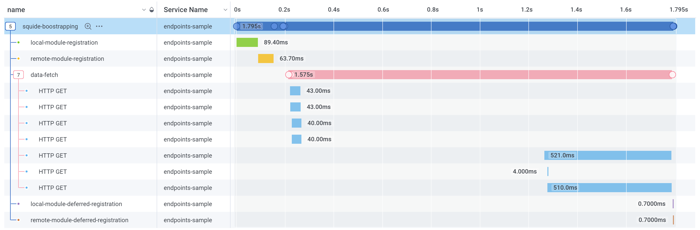
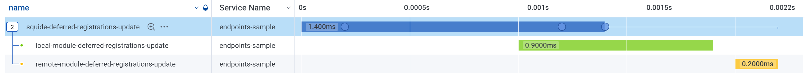
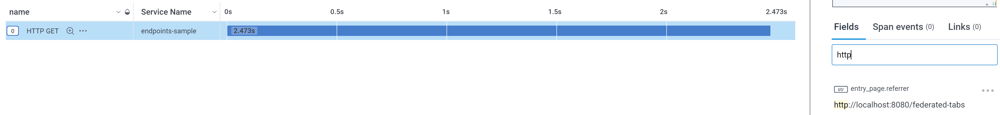
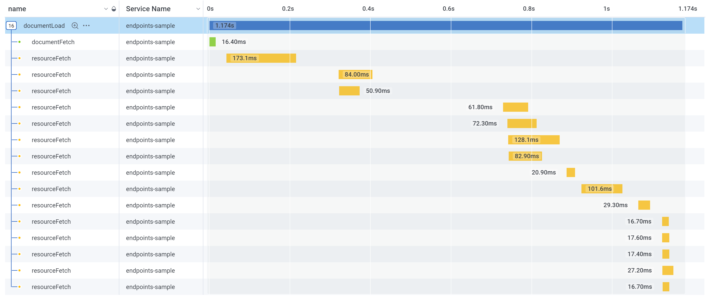
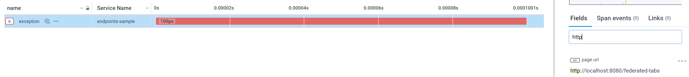
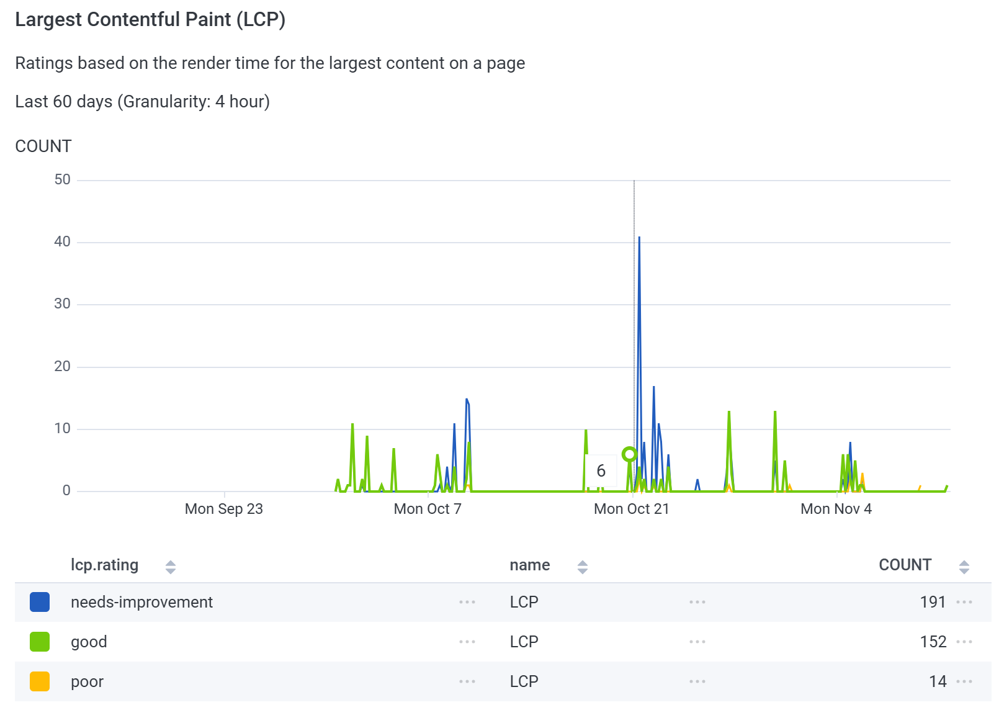
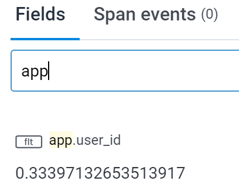

# Setup Honeycomb

!!!warning
Before going forward with this guide, make sure that you migrated to [v9.3](../upgrading/migrate-to-firefly-v9.3.md).
!!!

To monitor application performance, Workleap has adopted [Honeycomb](https://www.honeycomb.io/), a tool that helps teams manage and analyze telemetry data from distributed systems. Built on OpenTelemetry, Honeycomb provides a [robust API](https://open-telemetry.github.io/opentelemetry-js/) for tracking frontend telemetry.

Honeycomb's in-house [HoneycombWebSDK](https://docs.honeycomb.io/send-data/javascript-browser/honeycomb-distribution/) includes great default instrumentation. However, this instrumentation has to be extended to capture traces specific to Squide features. To facilitate this, Squide provides the `registerHoneycombInstrumentation` function.

## Setup the host application

Let's start by configuring the host application. First, open a terminal at the root of the host application and install the following packages:

+++ pnpm
```bash
pnpm add @squide/firefly-honeycomb @honeycombio/opentelemetry-web @opentelemetry/api @opentelemetry/auto-instrumentations-web
```
+++ yarn
```bash
yarn add @squide/firefly-honeycomb @honeycombio/opentelemetry-web @opentelemetry/api @opentelemetry/auto-instrumentations-web
```
+++ npm
```bash
npm install @squide/firefly-honeycomb @honeycombio/opentelemetry-web @opentelemetry/api @opentelemetry/auto-instrumentations-web
```
+++

!!!warning
While you can use any package manager to develop an application with Squide, it is highly recommended that you use [PNPM](https://pnpm.io/) as the guides has been developed and tested with PNPM.
!!!

## Register instrumentation

Then, update the host application bootstrapping code to register Honeycomb instrumentation:

```tsx !#22-24 host/src/bootstrap.tsx
import { ConsoleLogger, RuntimeContext, FireflyRuntime, bootstrap, type RemoteDefinition } from "@squide/firefly";
import { registerHoneycombInstrumentation } from "@squide/firefly-honeycomb";
import { register as registerMyLocalModule } from "@sample/local-module";
import { createRoot } from "react-dom/client";
import { App } from "./App.tsx";
import { registerHost } from "./register.tsx";

const Remotes: RemoteDefinition[] = [
    { name: "remote1" }
];

const runtime = new FireflyRuntime({
    loggers: [x => new ConsoleLogger(x)]
});

await bootstrap(runtime, {
    localModules: [registerHost, registerMyLocalModule],
    remotes: Remotes
});

// Register Honeycomb instrumentation.
registerHoneycombInstrumentation(runtime, "squide-sample", [/.+/g,], {
    endpoint: "https://squide-collector"
});

const root = createRoot(document.getElementById("root")!);

root.render(
    <RuntimeContext.Provider value={runtime}>
        <App />
    </RuntimeContext.Provider>
);
```

!!!warning
Avoid using `/.+/g,` in production, as it could expose customer data to third parties. Instead, ensure you specify values that accurately matches your application's backend URLs.
!!!

!!!warning
We recommend using an [OpenTelemetry collector](https://docs.honeycomb.io/send-data/opentelemetry/collector/) over an ingestion [API key](https://docs.honeycomb.io/get-started/configure/environments/manage-api-keys/#create-api-key), as API keys can expose Workleap to potential attacks.
!!!

With instrumentation in place, a few traces are now available :point_down:

### Bootstrapping flow

The performance of an application bootstrapping flow can now be monitored:

:::align-image-left

:::

### Deferred registration update

When a deferred registration is updated, the performance of the operation can be monitored:

:::align-image-left

:::

### Fetch requests

Individual fetch request performance can be monitored from end to end:

:::align-image-left

:::

### Document load

The loading performance of the DOM can be monitored:

:::align-image-left

:::

### Unmanaged error

When an unmanaged error occurs, it's automatically recorded:

:::align-image-left

:::

### Real User Monitoring (RUM)

The default instrumentation will automatically track the appropriate metrics to display RUM information:

:::align-image-left
{width=536 height=378}
:::
:::align-image-left
{width=536 height=378}
:::
:::align-image-left
{width=532 height=358}
:::

## Set custom user attributes

Most application needs to set custom attributes on traces about the current user environment. To help with that, Squide expose the [setGlobalSpanAttributes](../reference/honeycomb/setGlobalSpanAttributes.md) function.

Update your host application to include the `setGlobalSpanAttributes` function:

```tsx !#32-39 host/src/App.tsx
import { AppRouter, useProtectedDataQueries, useIsBootstrapping } from "@squide/firefly";
import { setGlobalSpanAttributes } from "@squide/firefly-honeycomb";
import { useEffect } from "react";
import { RouterProvider, createBrowserRouter, Outlet } from "react-router-dom";
import { SessionManagerContext, ApiError, isApiError, type Session } from "@sample/shared";
import { useSessionManagerInstance } from "./sessionManager.ts";

function BootstrappingRoute() {
    const [session] = useProtectedDataQueries([
        {
            queryKey: ["/api/session"],
            queryFn: async () => {
                const response = await fetch("/api/session");

                if (!response.ok) {
                    throw new ApiError(response.status, response.statusText);
                }

                const data = await response.json();

                const result: Session = {
                    user: {
                        id: data.id,
                    }
                };

                return result;
            }
        }
    ], error => isApiError(error) && error.status === 401);

    useEffect(() => {
        if (session) {
            // Update telemetry global attributes.
            setGlobalSpanAttributes({
                "app.user_id": session.user.id
            });
        }
    }, [session])

    const sessionManager = useSessionManagerInstance(session!);

    if (useIsBootstrapping()) {
        return <div>Loading...</div>;
    }

    return (
        <SessionManagerContext.Provider value={sessionManager}>
            <Outlet />
        </SessionManagerContext.Provider>
    );
}

export function App() {
    return (
        <AppRouter 
            waitForMsw
            waitForProtectedData
        >
            {({ rootRoute, registeredRoutes, routerProviderProps }) => {
                return (
                    <RouterProvider
                        router={createBrowserRouter([
                            {
                                element: rootRoute,
                                children: [
                                    {
                                        element: <BootstrappingRoute />,
                                        children: registeredRoutes
                                    }
                                ]
                            }
                        ])}
                        {...routerProviderProps}
                    />
                );
            }}
        </AppRouter>
    );
}
```

Now, every trace recorded after the session initialization will include the custom attributes `app.user_id`:

:::align-image-left
{width=204 height=161}
:::

## Custom traces

Squide does not provide a proprietary API for traces. Applications are expected to use the [OpenTelemetry API](https://docs.honeycomb.io/send-data/javascript-browser/honeycomb-distribution/#add-custom-instrumentation) to send custom traces to Honeycomb:

```tsx host/src/Page.tsx
import { useEffect } from "react";
import { trace } from "@opentelemetry/api";

const tracer = trace.getTracer("my-tracer");

export function Page() {
    useEffect(() => {
        // OK, this is a pretty bad example.
        const span = tracer.startSpan("my-span");
        span.end();
    }, []);

    return (
        <div>Hello from a page!</div>
    );
}
```

## Try it :rocket:

Start the application in a development environment using the `dev` script. Render a page, then navigate to your Honeycomb instance. Go to the "Query" page and type `name = squide-bootstrapping` into the "Where" input. Run the query, select the "Traces" tab at the bottom of the page and view the detail of a trace. You should view the performance of your application bootstrapping flow.

### Troubleshoot issues

If you are experiencing issues with this guide:

- Set the runtime [mode](http://localhost:5000/wl-squide/reference/runtime/runtime-class/#change-the-runtime-mode) to `development` mode or register the Honeycomb instrumentation in [debug](../reference/honeycomb/registerHoneycombInstrumentation.md#parameters).
- Open the [DevTools](https://developer.chrome.com/docs/devtools/) console. You'll see a log entry for every for each dispatched event, along with multiple console outputs from Honeycomb's SDK. Squide's bootstrapping instrumentation listens to events to send Honeycomb traces. Most events should match an Honeycomb trace and vice versa.
    - `[squide] Dispatching event "squide-local-modules-registration-completed"`
    - `[squide] Dispatching event "squide-remote-modules-registration-completed"`
    - `[squide] Dispatching event "squide-public-data-fetch-started"`
    - `[squide] Dispatching event "squide-public-data-ready"`
    - `@honeycombio/opentelemetry-web: Honeycomb link: ...`
- Refer to a working example on [GitHub](https://github.com/gsoft-inc/wl-squide/tree/main/samples/endpoints).
- Refer to the [troubleshooting](../troubleshooting.md) page.
